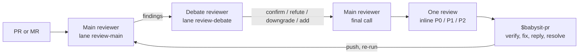

# review-skills

[](https://github.com/amElnagdy/review-skills/actions/workflows/tests.yml)
[](https://www.skills.sh/amElnagdy/review-skills)
[](LICENSE)

**Two models argue over a pull request before anything is posted. You keep the merge.**

`debate-review` has a main reviewer read the PR, a second reviewer try to knock its findings down,
and the main reviewer make the final call. One review with inline comments lands on the PR, posted
from your own `gh` or `glab` account. `babysit-pr` then works the rounds: verifies each finding, fixes
the blockers, replies in-thread, resolves, and re-triggers the next review. Both skills run through
whatever coding agent you already drive (Claude Code, Codex, Cursor, OpenCode, Grok, and others) and
the model subscriptions you already pay for.

```bash
npx skills add amElnagdy/review-skills
```

Then ask your agent:

```text
Use $debate-review on https://github.com/owner/repo/pull/123
Use $babysit-pr on PR 123 until it is ready to merge.
```



## The skills

| Skill | Job | Never does |
| --- | --- | --- |
| [`debate-review`](skills/debate-review/SKILL.md) | Reviews a GitHub PR or GitLab MR with two models in sequence and posts one `COMMENT` review with inline comments. Findings that survive the debate are posted as agreed; findings the second model refuted but the main reviewer kept are posted as contested, with both sides' reasoning. | Edit code, approve, request changes, post twice for the same head sha. |
| [`babysit-pr`](skills/babysit-pr/SKILL.md) | Harvests every reviewer thread on the PR (debate-review, Codex, Greptile, any bot), checks each finding against the code, fixes what is real, replies in-thread with evidence and attribution, resolves, and re-runs the review for the next round. Reports when the PR meets the merge gate. | Merge, resolve a thread it did not answer, reply as anyone other than "model on behalf of user". |

## Requirements

- Node 18 or newer.
- `gh` (GitHub) or `glab` (GitLab, including self-hosted) logged in to an account that can comment on
  the PR. Reviews and replies post as that account.
- [delegate-skills](https://github.com/amElnagdy/delegate-skills), which dispatches the reviewer
  models through the `*-delegate` relays, read-only.
- Two delegate lanes named `review-main` and `review-debate`. Create them once with `$delegate-setup`:

  ```text
  Use $delegate-setup to add two lanes: review-main on claude at high effort and review-debate on codex at high effort.
  ```

  Pick two different implementers. The debate is only worth something when the second model does not
  share the first one's blind spots. Keep these lanes for the reviewer; if you already use a `debate`
  lane for plan debates, leave it alone. Only implementers whose relay supports `--read-only` are
  accepted, so the reviewers cannot touch your tree.

## What a review looks like

Each finding is one inline comment, anchored to the lines it is about, rendered as a forge alert so
the colour reads before the words:

| Level | Meaning | Rendered as |
| --- | --- | --- |
| P0 | blocking, security | `[!CAUTION]` |
| P1 | blocking, anything else | `[!WARNING]` |
| P2 | non-blocking | `[!NOTE]` |

The review body carries a level count table, who reviewed, and a short summary. Each comment and the
body start with an HTML marker (`<!-- debate-review ... -->`) that `babysit-pr` uses to recognise the
threads, since they are posted from your account rather than a bot's. One review per head sha: a
re-run on the same push exits with code 3 instead of posting again. Templates and the marker format
are in [`comment-format.md`](skills/debate-review/references/comment-format.md); the JSON contract
between the three passes is in [`schema.md`](skills/debate-review/references/schema.md).

The reviewers are prompted for precision, not volume: blocking bugs with a concrete trigger and wrong
result, spec and standards violations quoted against the rule, and little else. The second reviewer
can only refute a finding when it can point at the code that makes it impossible. Findings below the
confidence floor are dropped before anything is posted.

## GitHub and GitLab

| | GitHub | GitLab |
| --- | --- | --- |
| Review posting | `gh api`, PR review with inline comments | `glab api`, MR discussions with diff positions |
| Thread harvest (babysit-pr) | GraphQL review threads + REST reviews | discussions + notes |
| Reply and resolve (babysit-pr) | verified live | implemented, not yet verified on a live instance |
| Bot author detection | reliable (`Bot` type) | only when the instance exposes `author.bot`; debate-review threads are found by marker either way |

## Run it by hand

Your agent normally runs these for you. They are here for testing, CI, or when there is no agent in
the loop. `<skill-dir>` is the directory containing the skill's `SKILL.md`.

```bash
node "<skill-dir>/scripts/review-pr.mjs" <pr-url | number> --dry-run   # print, do not post
node "<skill-dir>/scripts/review-pr.mjs" <pr-url | number>             # post
"<babysit-skill-dir>/scripts/threads.sh" <number>                      # harvest one round as JSON
```

`review-pr.mjs --help` lists the flags: `--main` / `--debate` to override the lanes for one run,
`--contested post|drop`, `--min-confidence`, `--timeout` (default 30 minutes per reviewer), `--force`
to post again on the same head, `--keep` to leave the temporary worktree. Every run leaves its briefs,
raw model output, and the three JSON documents under `~/.cache/debate-review/<owner>__<repo>/<N>/<head>/`
so a surprising review can be traced back to the pass that produced it.

## How this relates to the sibling repos

- [delegate-skills](https://github.com/amElnagdy/delegate-skills) is the transport. `review-pr.mjs`
  reads your lanes and calls the matching relay; this repo has no model code of its own.
- [guard-skills](https://github.com/amElnagdy/guard-skills) are review lenses for code an agent just
  wrote. The reviewers here cannot load them (the relays run the reviewer with skills disabled, on
  purpose), and they are tuned for a different job than Clean Code checks. Where a guard fits is the
  babysitter's own fixes: `babysit-pr` runs the matching guard on a fix before pushing it, when one is
  installed.

## Development

```bash
node --test test/*.test.mjs
```

The babysit tests run `threads.sh` end to end against fake `gh` and `glab` binaries in
`test/fixtures/babysit/`, so both forge shapes are covered without network.

## License

[MIT](LICENSE)
